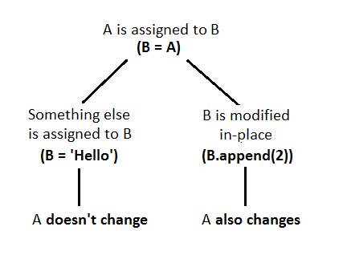

# python-basic

### 變數範圍
1. 變數範圍的建立是在指定時發生，而不是在取用時發生

2. 實際上，在Python中變數可以在四個範圍中建立或尋找。
	1. 函式（Local functon）
	2. 外包函式（Endosing function）
	3. 全域（Global）
	4. 內建（Builtin）
	
	```py
	x = 10       　　# 全域
	
	def outer():
		y = 20        # 在 outer() 函式範圍
	
		def inner():
			z = 30    # 在 inner() 函式範圍
			print(x)  # 往外找到global的x
			print(y)  # 往外找到outer的x
	
	print(x)       # 往外找到global的x
	```
3. ``global`` and ``nonlocal``
	1. ``global``: 表明為global變數, 不會再重新創建
	
	```py
	x = 10
	def some():
		global x
		x = 20
	```
	
	2. ``nonlocal``: 表明為非local變數, 不會再重新創建

### reference in python



### sort and sorted

``sorted()`` returns a new sorted list, leaving the original list unaffected. ``list.sort()`` sorts the list in-place, mutating the list indices, and returns None (like all in-place operations).

### loop else
Python中的for、while循环都有一个可选的else分支（类似if语句和try语句那样），在循环迭代正常完成之后执行。换句话说，如果我们不是以除正常方式以外的其他任意方式退出循环，那么else分支将被执行。

```py
for i in range(5):
     print(i)
else:
     print('Iterated over everything :)')
# 0
# 1
# 2
# 3
# 4
# Iterated over everything :)
for i in range(5):
    if i == 2:
        break
    print(i)
else:
    print('Iterated over everything :)')
# 0
# 1
```